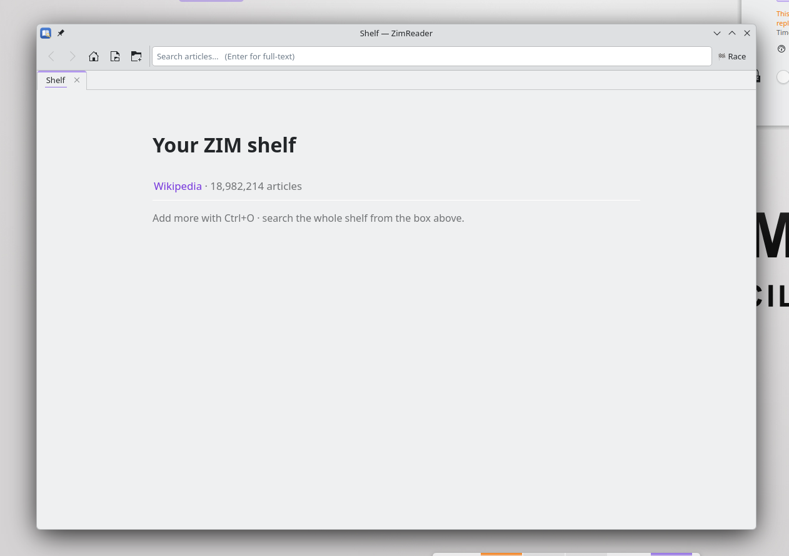

# zimreader

a little offline wikipedia reader for kde plasma / kubuntu. point it at a `.zim` file (the kiwix
format) and read wikipedia, wiktionary, stack exchange, whatever, fully offline. it matches your
plasma light/dark theme, has proper search, tabs, and a wikirace game because why not.



## what it does

- matches your plasma light/dark theme. the ui follows breeze, and the article pages flip
  light/dark to match too, live, the second you toggle your theme.
- search bar with live title suggestions and full-text search. on the shelf page it searches
  every zim you've got, inside an article it just searches that one.
- a "shelf" you can load a bunch of `.zim` files onto. they stick around between launches.
- tabs (ctrl+t, ctrl+w, middle-click a link) and find-in-page (ctrl+f).
- wikirace. hit the race button, it drops you on a random article and gives you a random target,
  get there using only the links inside the articles. fewest clicks wins. search is locked while
  you race, thats the whole point.
- real article html (images, links, tables) rendered with qtwebengine, straight out of the zim.

built with pyside6 (qt 6) + [libzim](https://github.com/openzim/python-libzim) + qtwebengine.

## running it

grab a `.zim` first from https://download.kiwix.org/zim/ (something small like `wikipedia_en_100`
is good for a test).

### easiest, flatpak

```bash
bash build-flatpak.sh
```

that installs flatpak-builder if you dont have it, sorts out flathub, picks a kde runtime version
that actually exists, builds the thing, and installs it. after that its just a normal app in your
menu ("ZimReader"). if webengine acts up on the first launch (it gets weird inside flatpak), run
`bash fix-webengine.sh` once and it sorts itself out.

### or just run it, no packaging

```bash
sudo apt install python3-venv libxcb-cursor0
bash run-dev.sh ~/some-wikipedia.zim
```

makes a venv, pip installs pyside6 + libzim, runs it.

## shortcuts

- `ctrl+o` add a zim
- `ctrl+k` jump to search
- `ctrl+f` find in page
- `ctrl+t` / `ctrl+w` new tab / close tab
- `alt+home` back to the shelf

## how its put together

| bit | file |
|---|---|
| libzim wrapper (open, suggest, full-text search) | `zimreader/backend.py` |
| the shelf (multiple zims, each with its own id) | `zimreader/shelf.py` |
| the `zim://` url scheme (serves articles/images/css out of a zim) | `zimreader/scheme.py` |
| the window (tabs, search, theming, wikirace, find) | `zimreader/window.py` |

dark mode is a cheap trick: invert the whole page, then un-invert the images and video so photos
still look right. works on any wikipedia css without having to understand it.

## notes on the flatpak

- the version number (6.7 and friends) has to be one that both `org.kde.Platform` and
  `io.qt.PySide.BaseApp` actually have on flathub. the build script figures that out, or you can
  just pass one: `bash build-flatpak.sh 6.8`.
- webengine inside flatpak needs its sandbox off and gpu compositing off, it crashes otherwise.
  the launcher already handles that; `fix-webengine.sh` does the same to an already-built install
  without a rebuild.

## claude usage

- claude was used to help with zim related importing
- if you dont like that, dont use it.
